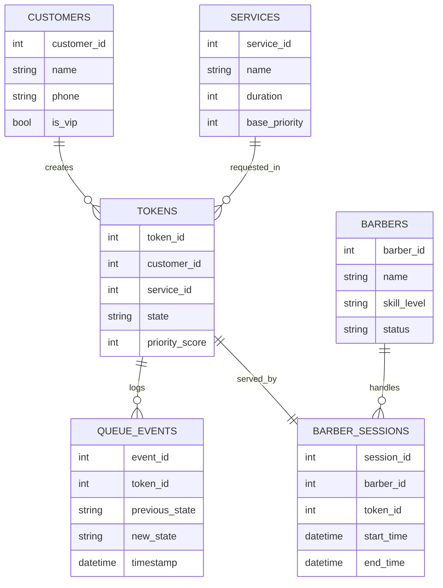

# ER Diagram — Database Structure

Defines tables and relationships.

```mermaid
erDiagram

CUSTOMERS ||--o{ TOKENS : creates
SERVICES ||--o{ TOKENS : requested_in
TOKENS ||--o{ QUEUE_EVENTS : logs
BARBERS ||--o{ BARBER_SESSIONS : handles
TOKENS ||--|| BARBER_SESSIONS : served_by

CUSTOMERS {
  int customer_id
  string name
  string phone
  bool is_vip
}

BARBERS {
  int barber_id
  string name
  string skill_level
  string status
}

SERVICES {
  int service_id
  string name
  int duration
  int base_priority
}

TOKENS {
  int token_id
  int customer_id
  int service_id
  string state
  int priority_score
}

BARBER_SESSIONS {
  int session_id
  int barber_id
  int token_id
  datetime start_time
  datetime end_time
}

QUEUE_EVENTS {
  int event_id
  int token_id
  string previous_state
  string new_state
  datetime timestamp
}
```
