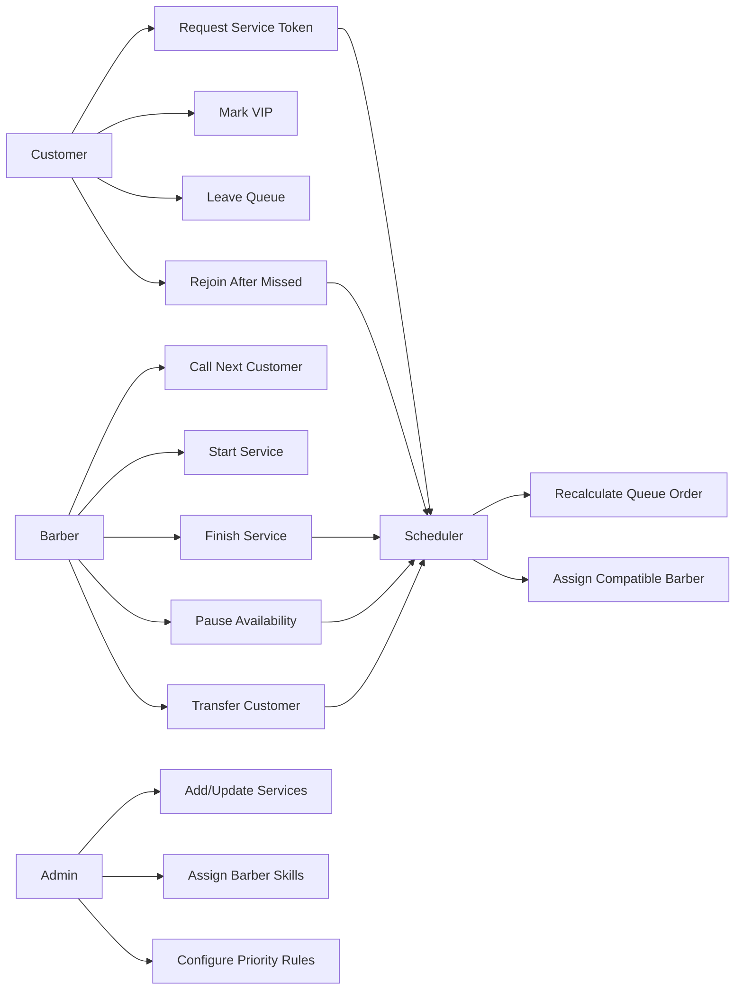
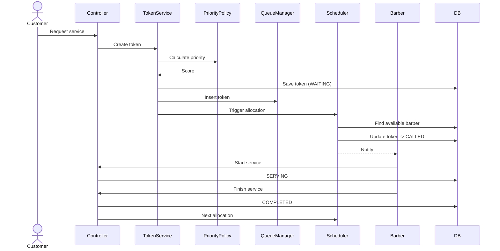
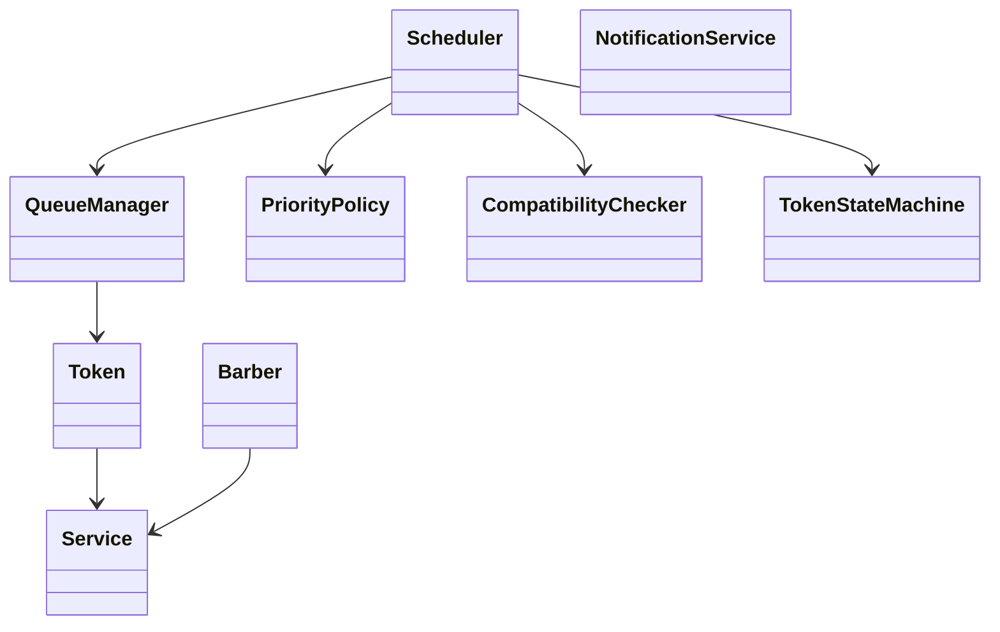
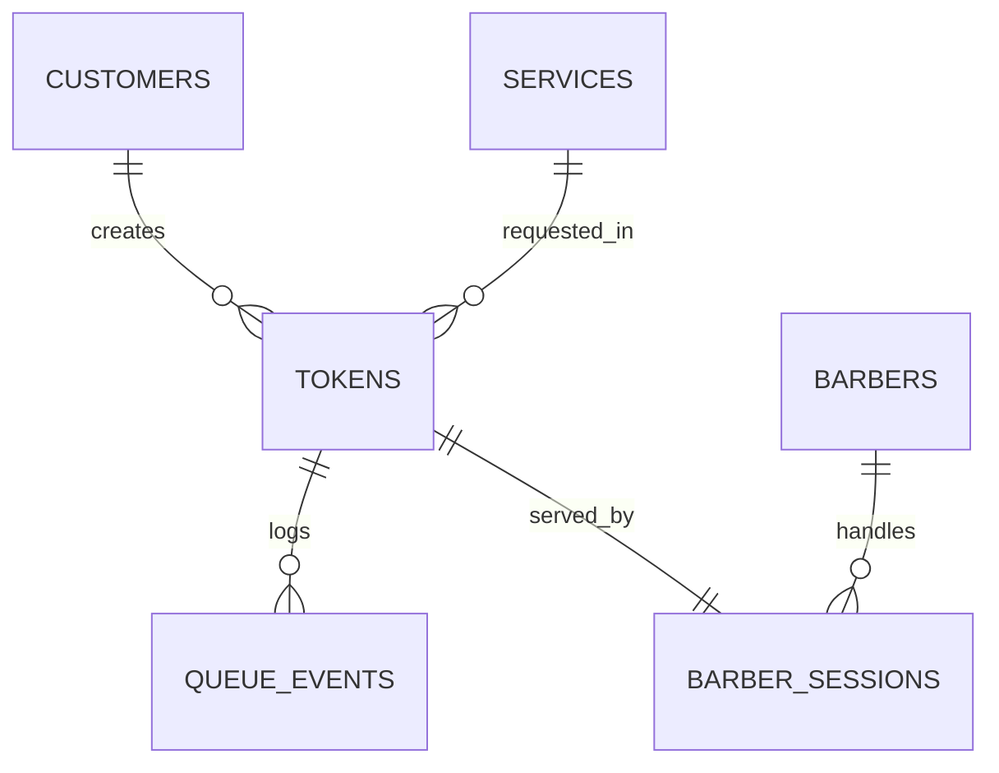

# Smart Salon Queue & Service Allocation System

A real-time backend scheduling engine that dynamically assigns walk-in customers to compatible barbers based on service type, priority rules, and live availability.

Unlike traditional FIFO token systems, the queue continuously recalculates order after every event (service finish, VIP entry, barber break, etc.).

---

## Core Idea

Customers don’t get a fixed position in line.

The system continuously decides:

**Which customer should be served next by which barber at this moment**

This turns the queue into a scheduling engine instead of a waiting list.

---

## Actors

* Customer
* Barber (Operator)
* Admin
* System Scheduler (automated decision engine)

---

## System Behaviour Overview

### Use Case



---

### Main Flow



---

### Backend Architecture



---

### Database Structure



---

## Scheduling Logic

Priority Score:

```
priorityScore = servicePriority + VIPBonus + waitingTimeFactor
```

Ensures:

* Fairness
* No starvation
* Efficient barber utilization

---

## Token Lifecycle

```
CREATED → WAITING → CALLED → SERVING → COMPLETED
           ↓
        MISSED / CANCELLED / REASSIGNED
```

---

## Project Focus

This project emphasizes backend system design:

* State machine modelling
* Scheduling logic
* Resource allocation
* Event driven updates
* Data consistency

UI is only a control panel for triggering backend behaviour.

---

## Planned Tech Stack

Backend: Node.js / Express
Database: MySQL
Realtime: WebSockets
Frontend: Minimal dashboard
