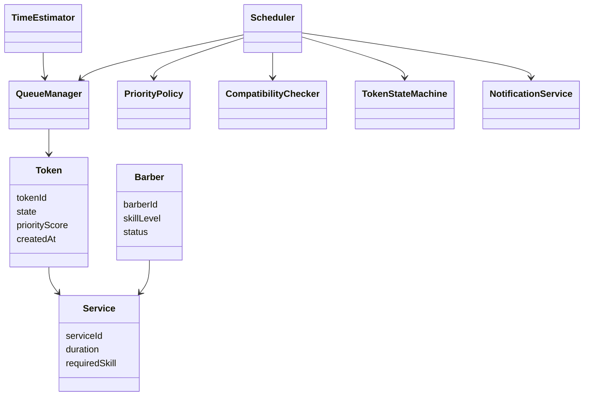

# Class Diagram — Backend Architecture

Shows responsibility-based backend components.

```mermaid
classDiagram

class Token {
  tokenId
  state
  priorityScore
  createdAt
}

class Service {
  serviceId
  duration
  requiredSkill
}

class Barber {
  barberId
  skillLevel
  status
}

class QueueManager
class Scheduler
class PriorityPolicy
class CompatibilityChecker
class TokenStateMachine
class NotificationService
class TimeEstimator

Scheduler --> QueueManager
Scheduler --> PriorityPolicy
Scheduler --> CompatibilityChecker
Scheduler --> TokenStateMachine
Scheduler --> NotificationService

QueueManager --> Token
Token --> Service
Barber --> Service
TimeEstimator --> QueueManager
```
