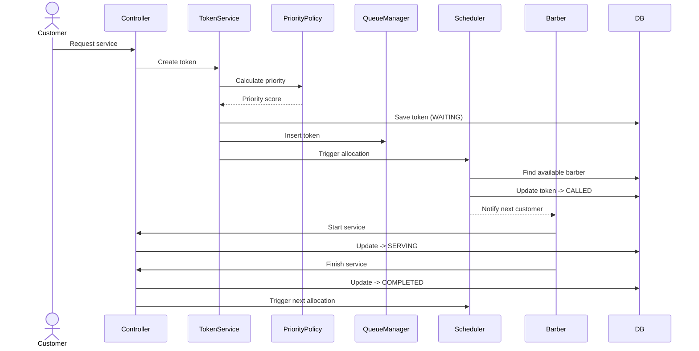

# Sequence Diagram — Customer Service Flow

Represents end-to-end flow from customer entry to service completion.

```mermaid
sequenceDiagram
actor Customer
participant Controller
participant TokenService
participant PriorityPolicy
participant QueueManager
participant Scheduler
participant Barber
participant DB

Customer->>Controller: Request service
Controller->>TokenService: Create token
TokenService->>PriorityPolicy: Calculate priority
PriorityPolicy-->>TokenService: Priority score

TokenService->>DB: Save token (WAITING)
TokenService->>QueueManager: Insert token
TokenService->>Scheduler: Trigger allocation

Scheduler->>DB: Find available barber
Scheduler->>DB: Update token -> CALLED
Scheduler-->>Barber: Notify next customer

Barber->>Controller: Start service
Controller->>DB: Update -> SERVING

Barber->>Controller: Finish service
Controller->>DB: Update -> COMPLETED
Controller->>Scheduler: Trigger next allocation
```
