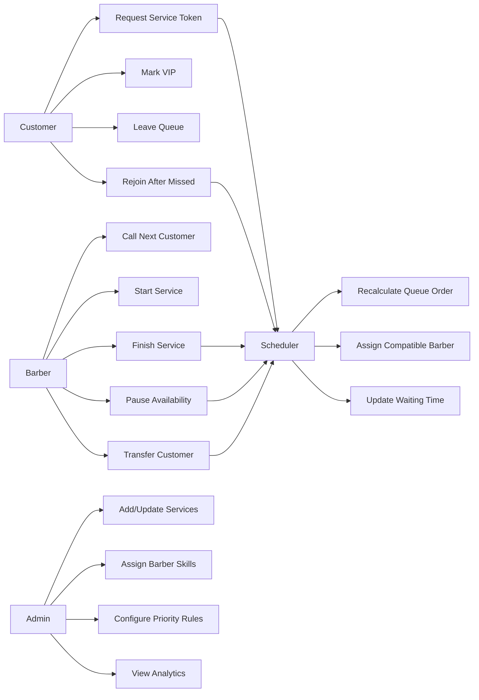

# Use Case Diagram — Smart Salon Queue & Service Allocation System

This diagram shows how different actors interact with the system and which responsibilities are automated by the scheduler.

```mermaid
flowchart LR

Customer --> RequestToken[Request Service Token]
Customer --> MarkVIP[Mark VIP]
Customer --> LeaveQueue[Leave Queue]
Customer --> Rejoin[Rejoin After Missed]

Barber --> CallNext[Call Next Customer]
Barber --> StartService[Start Service]
Barber --> FinishService[Finish Service]
Barber --> Pause[Pause Availability]
Barber --> Transfer[Transfer Customer]

Admin --> ManageServices[Add/Update Services]
Admin --> AssignSkills[Assign Barber Skills]
Admin --> ConfigureRules[Configure Priority Rules]
Admin --> ViewAnalytics[View Analytics]

RequestToken --> Scheduler
FinishService --> Scheduler
Pause --> Scheduler
Transfer --> Scheduler
Rejoin --> Scheduler

Scheduler --> Recalculate[Recalculate Queue Order]
Scheduler --> AssignBarber[Assign Compatible Barber]
Scheduler --> UpdateWait[Update Waiting Time]
```
